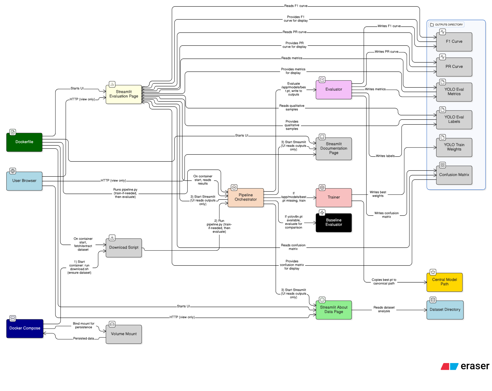

# Traffic Detection Analysis, Training, and Evaluation

## Overview
- Focus: Object detection with bounding boxes for traffic categories (no segmentation).
- Components:
  - Streamlit multipage app for data analysis and report visualization (no manual training from UI).
  - Ultralytics YOLO training/evaluation pipeline (CPU-compatible).
  - Dockerized for reproducibility.
## Arch Diagram

## Repository Structure
```
src/
  analyzer.py               # Class-based dataset analytics
  analysis.py               # Programmatic analysis utilities (no UI)
  dashboard.py              # Streamlit landing page
  pages/
    1_About_Data.py        # Data analysis dashboard
    3_Evaluation.py        # Read-only evaluation reports (visualization only)
train_yolo.py              # Scripted training entrypoint
evaluate_yolo.py           # Scripted evaluation entrypoint
Dockerfile                 # Containerization
requirements.txt           # Python dependencies
download.sh                # Dataset preparation
run.sh                     # Build & run container end-to-end
data/
  traffic-detection-project/  # Dataset (mounted or extracted here)
```

## Getting Started
First cloue the repo and start the process

1) Build and run with Docker Compose (dataset auto-downloaded inside container):
```bash
docker-compose up --build
```
Then open `http://127.0.0.1:8501/`.

## Streamlit Pages
- About Data: dataset structure, class distributions, per-image stats, bbox stats, co-occurrence, examples.
- Evaluation: read-only page that visualizes the latest one-time evaluation reports produced at startup.

## Modeling Rationale
- Chosen model: Ultralytics YOLOv8n for speed and a strong baseline on traffic objects.
- Architecture: one-stage detector with CSP-based backbone, PAN/FPN neck, and decoupled heads.
- Advantages: mature tooling, easy dataset integration via `data.yaml`, good CPU fallback support.

### Metrics and Interpretation
- Precision: fraction of predicted boxes that are correct. High precision means fewer false positives.
- Recall: fraction of ground-truth boxes recovered. High recall means fewer false negatives.
- mAP@0.50: mean average precision at IoU 0.50; emphasizes coarse localization.
- mAP@0.50:0.95: averaged over IoU thresholds 0.50–0.95; stricter, more indicative of localization quality.

### Failure Analysis
The evaluation step writes `predictions.json`. Use the included failure analysis to inspect error patterns:
```bash
python src/analysis_failures.py \
  --data_yaml /app/data/traffic-detection-project/data.yaml \
  --eval_dir /app/data/outputs/yolo_eval
```
This produces:
- `failures/failures_summary.csv`: counts of FP/FN per class
- `failures/failures_detailed.csv`: per-image breakdown
- `failures/fail_*.jpg`: images with FP (red) and FN (yellow) boxes overlaid

## Reproducibility
- All dependencies pinned via `requirements.txt` and installed in Docker.
- Dataset mounted at `/app/data` for consistent paths.
- Run everything end-to-end with `run.sh`.

## Scripts
- End-to-end pipeline: `python src/pipeline.py` (invoked automatically by `start.sh` on first run per image build)
- Training (script): `python src/train_yolo.py`
- Evaluation (script): `python src/evaluate_yolo.py`

## One-time pipeline per image build
- The container entrypoint (`start.sh`) runs a one-time clean pipeline after each image rebuild.
- It clears previous outputs under `data/outputs/`, runs training (1 epoch) and evaluation into `outputs/yolo_train` and `outputs/yolo_eval`, and then starts the app.
- Subsequent container starts reuse the cached outputs and do not retrain.

Force a fresh pipeline without rebuilding:
```bash
rm -f data/.markers/build-id && docker-compose up
```

## Development
- Style: PEP8; use `black` and `pylint` locally.
- Docstrings provided for public modules and classes.

## Submission Checklist
- [x] Clear README and rationale
- [x] Reproducible Docker workflow
- [x] Organized repository structure (analysis, model, pipeline)
- [x] Streamlit pages for Data, Training, Evaluation
- [x] Scripts and outputs saved under `data/`


